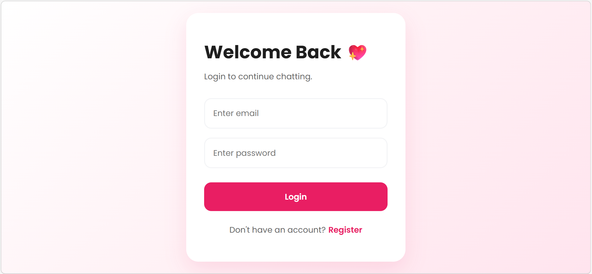
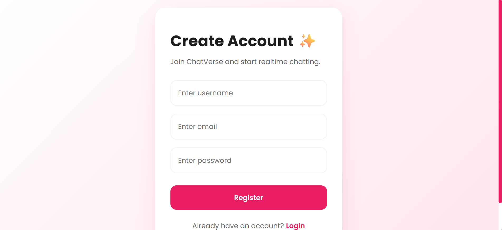
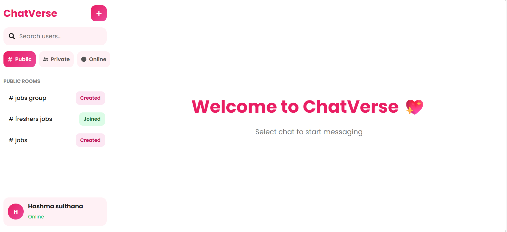
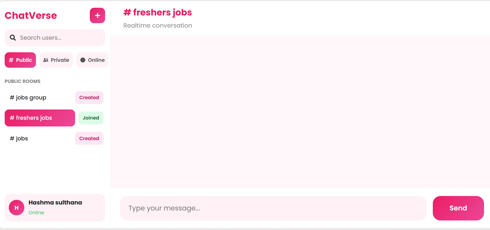
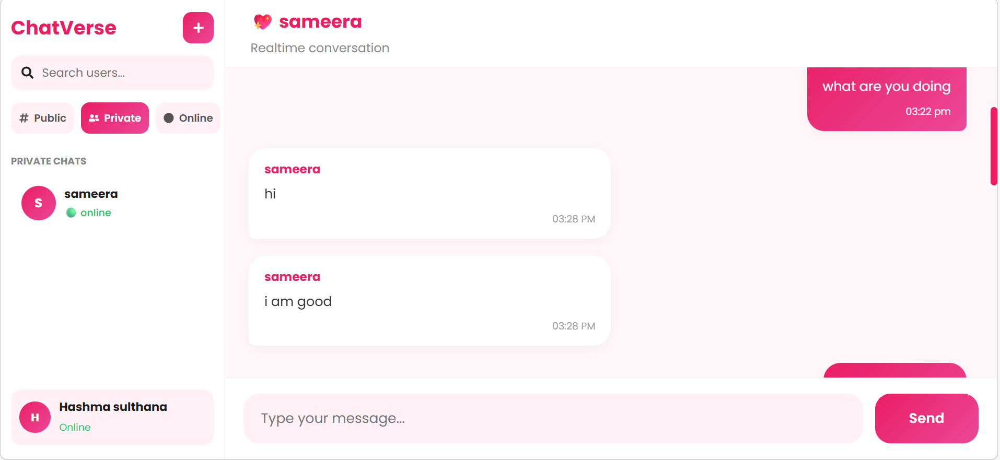
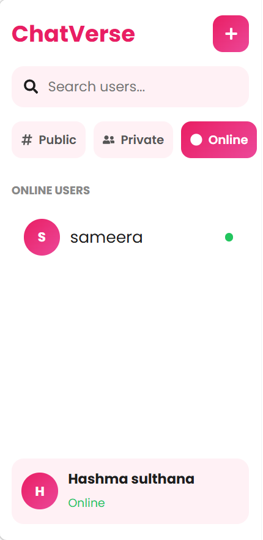
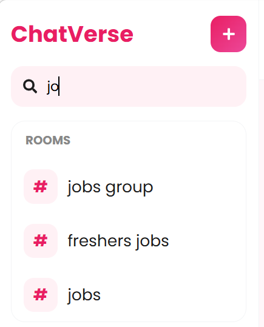

# ChatVerse 💖

### Real-Time Chat Application using React.js, Node.js, Socket.io & SQLite

---

# 🌟 Preview

## 🔐 Login Page



---

## 📝 Register Page



---

## 💬 Main Dashboard



---

## 👥 Public Rooms



---

## 💖 Private Chat



---

## 🟢 Online Users 



---

## 🔍 Search Feature



---

## 🖼️ Profile Upload


---

# 📌 Project Overview

ChatVerse is a modern real-time chat application inspired by platforms like Discord, WhatsApp, and Telegram.

The application supports:

* Public chat rooms
* Private messaging
* Real-time communication
* Online/offline user status
* Typing indicators
* Notifications
* Profile image uploads
* Dynamic search system
* Room creation & joining system

The project is built using:

* React.js
* Node.js
* Express.js
* Socket.io
* SQLite

---

# 🚀 Features

## 🔐 Authentication System

* User Registration
* User Login
* JWT Authentication
* Password Hashing
* Secure APIs

---

## 💬 Real-Time Messaging

* Instant messaging using Socket.io
* Real-time updates without refresh
* Persistent message history
* Public & private chat support

---

## 👥 Public Rooms

Users can:

* Create rooms
* Join rooms
* Send messages inside joined rooms
* Receive notifications

---

## 💖 Private Messaging

* One-to-one private chats
* Unique private room IDs
* Persistent private chat list
* WhatsApp-style messaging experience

---

## 🟢 User Presence System

* Online users list
* Offline user detection
* Typing indicators
* Real-time status updates

---

## 🔔 Notification System

* Notification badges
* Toast notifications
* Unread message count

---

## 🔍 Search System

Users can search:

* User profiles
* Public rooms

Features:

* Case-insensitive search
* Dynamic results
* Profile image preview

---

## 🖼️ Profile Upload

* Upload custom profile image
* Image visible in chats
* Image visible in search results
* Image visible in online users list

---

## 🎨 UI Design

* Royal Pink & White Theme
* Responsive Design
* Discord-inspired dashboard
* Modern clean interface

---

# 🛠️ Tech Stack

## Frontend

* React.js
* CSS3
* Axios
* React Icons
* React Toastify

---

## Backend

* Node.js
* Express.js
* Socket.io
* JWT
* Multer

---

## Database

* SQLite

---

# 📂 Project Structure

```bash
ChatVerse/
│
├── client/
│   ├── src/
│   │   ├── components/
│   │   ├── pages/
│   │   ├── services/
│   │   └── App.js
│
├── server/
│   ├── controllers/
│   ├── routes/
│   ├── middleware/
│   ├── database/
│   ├── uploads/
│   └── server.js
```

---

# ⚙️ Installation Guide

## 1️⃣ Clone Repository

```bash
git clone YOUR_GITHUB_REPO_LINK
```

---

# 📦 Backend Setup

## Move to server folder

```bash
cd server
```

---

## Install Dependencies

```bash
npm install
```

---

## Start Backend Server

```bash
npm start
```

Server runs on:

```bash
http://localhost:5000
```

---

# 💻 Frontend Setup

## Move to client folder

```bash
cd client
```

---

## Install Dependencies

```bash
npm install
```

---

## Start React App

```bash
npm run dev
```

Frontend runs on:

```bash
http://localhost:5173
```

---

# 🗄️ Database Schema

## users

Stores:

* username
* email
* password
* profilePic

---

## rooms

Stores:

* roomName
* createdBy

---

## messages

Stores:

* sender
* room
* message
* timestamp

---

## joined_rooms

Stores:

* username
* roomName

---

# 🔌 Socket.io Events

| Event             | Description           |
| ----------------- | --------------------- |
| user_join         | User comes online     |
| join_room         | Join public room      |
| join_private_chat | Join private room     |
| send_message      | Send message          |
| receive_message   | Receive message       |
| typing            | Typing event          |
| show_typing       | Display typing status |

---

# 📸 Major Features Demonstrated

✅ Authentication

✅ Room Creation

✅ Join Room System

✅ Private Messaging

✅ Notifications

✅ Typing Indicator

✅ Online/Offline Status

✅ Search Users & Rooms

✅ Profile Upload

✅ Real-Time Messaging

---

# 🧠 Learning Outcomes

This project helped improve knowledge in:

* Full Stack Development
* React State Management
* Socket.io Real-Time Communication
* REST APIs
* SQLite Database Design
* Authentication Systems
* Responsive UI Design

---

# 🌐 Deployment

Frontend:

* Vercel
* Netlify

Backend:

* Render
* Railway

---

# 👩‍💻 Developed By

## Hashma Sulthana Shaik

B.Tech - Information Technology

Full Stack Developer

---

# 💖 Thank You

Thank you for reviewing ChatVerse.

This project demonstrates real-time full-stack web application development with modern UI and scalable architecture.
